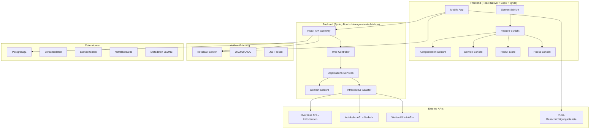
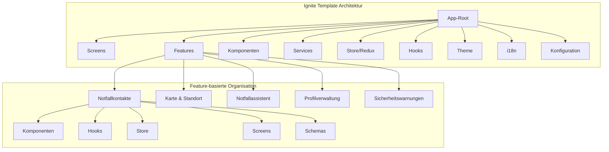
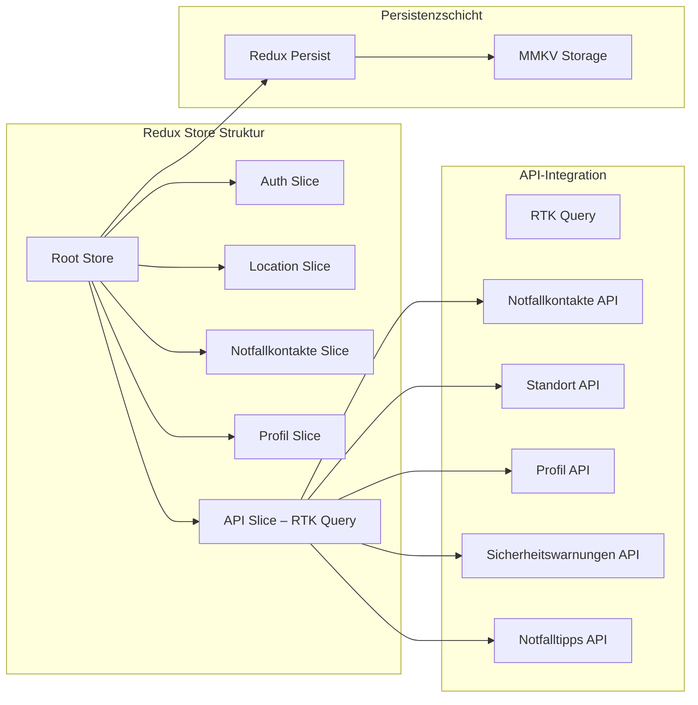
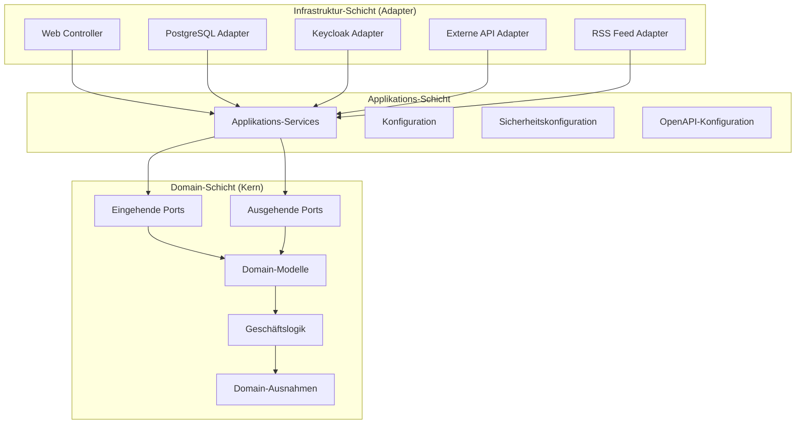
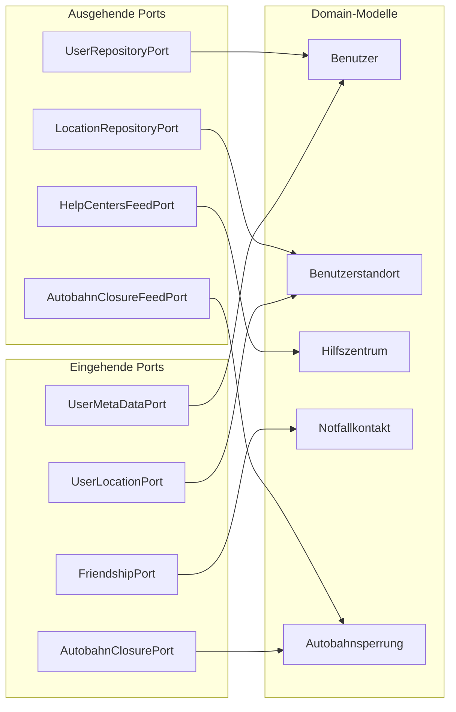
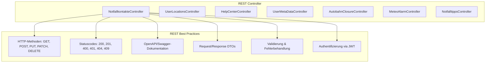
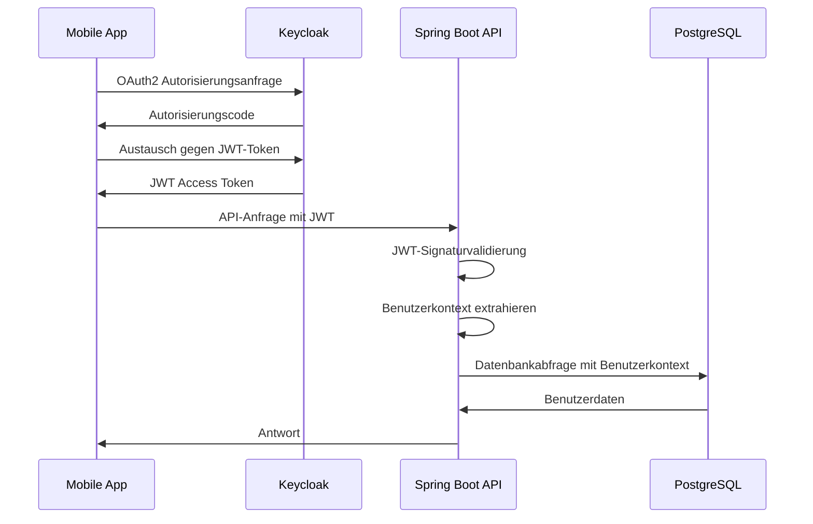
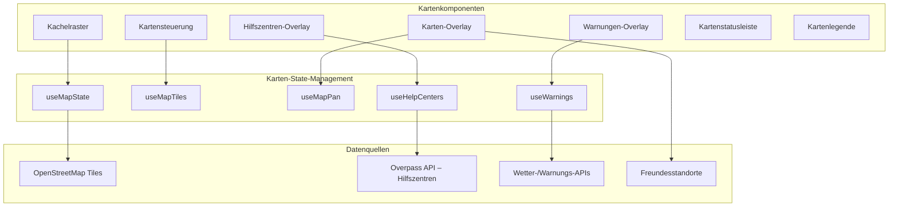
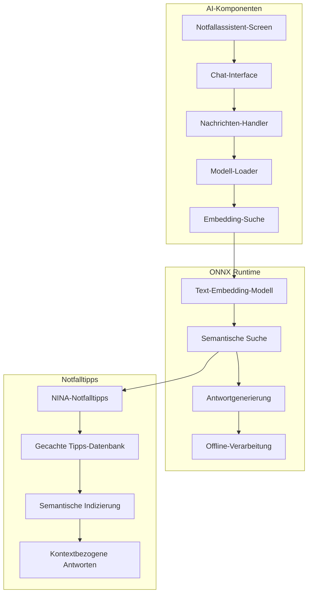

# 🛡️ SafeNet – Systemarchitektur-Dokumentation

## 🏗️ Gesamtarchitektur des Systems

---

## 🎯 Frontend-Architektur (React Native + Ignite-Template)

### Ignite-Template-Struktur

### Redux-State-Management

### Wichtige Frontend-Funktionen

* **Notfallkontakte:** Verwaltung von Freunden mit Standortfreigabe in Echtzeit
* **Interaktive Karte:** Individuelle Kachelkarte mit Hilfszentren, Warnungen und Freundesstandorten
* **Notfallassistent (AI):** KI-gestützter Chat mit ONNX Runtime für Offline-Tipps
* **Profilverwaltung:** Benutzer-Metadaten inkl. medizinischer Infos und Präferenzen
* **Sicherheitswarnungen:** Echtzeit-Benachrichtigungen zu Wetter, Polizei & Notfällen
* **Offline-First:** Persistente Speicherung wichtiger Daten über MMKV & AsyncStorage

---

## 🏛️ Backend-Architektur (Hexagonal / Ports & Adapter)

### Umsetzung der Hexagonalen Architektur

### Domain-Modelle & Ports

### REST-API-Design (Best Practices)

---

## 🔐 Sicherheitsarchitektur

### Authentifizierungs- & Autorisierungsablauf

### Sicherheitsfunktionen

* **OAuth2/OIDC:** Standardisierte Authentifizierung über Keycloak
* **JWT Tokens:** Zustandslose Sitzungen mit Benutzerkontext
* **Rollenbasierter Zugriff:** Feingranulare Rechteverwaltung
* **CORS-Konfiguration:** Sichere Cross-Origin-Anfragen
* **HTTPS-Erzwingung:** Verschlüsselte Kommunikation
* **Isolierung des Benutzerkontexts:** Zugriff nur auf eigene Daten

---

## 🗺️ Kartenarchitektur

### Benutzerdefinierte Kartenimplementierung

---

## 🤖 KI/ML-Architektur (Notfallassistent)

### ONNX Runtime-Integration

---

## 🔧 Technologie-Integrationen

### Zentrale Integrationsmuster

* **Frontend–Backend:** RESTful APIs mit JWT-Authentifizierung
* **State Management:** Redux & RTK Query für Serverstatus
* **Offline-Synchronisation:** Redux Persist mit Konfliktlösung
* **Echtzeit-Updates:** Push-Benachrichtigungen (zukünftig WebSockets)
* **Externe APIs:** Adapter-Pattern zur Anbindung von Drittanbietern
* **KI/ML:** ONNX Runtime für Offline-Unterstützung bei Notfällen
* **Karten:** Individuelle Kachelkarten mit Overlays
* **Authentifizierung:** OAuth2-Flow mit Keycloak-Integration
