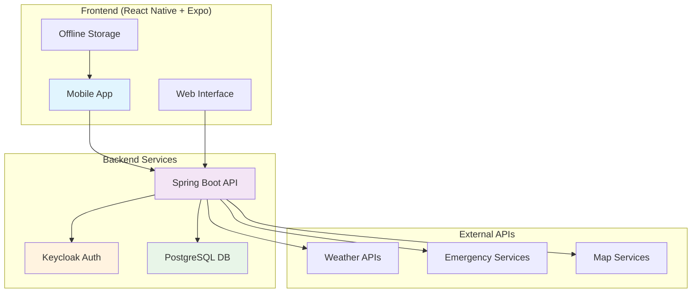
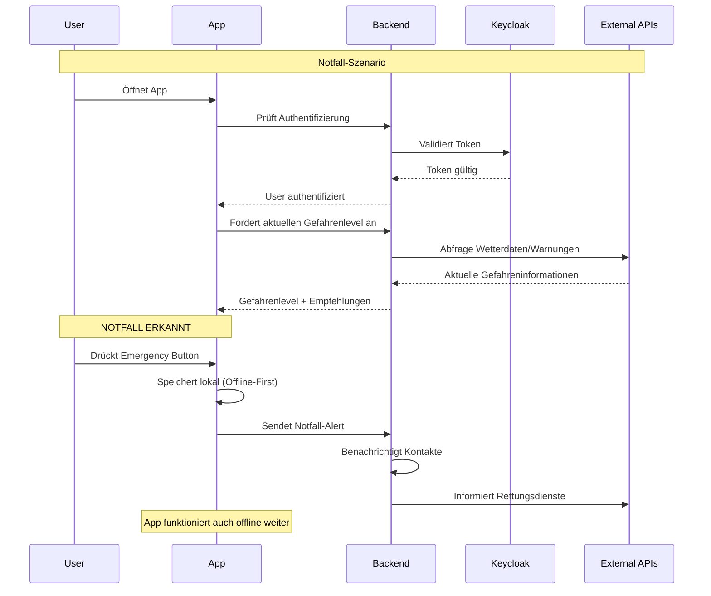

# 🛡️ SafeNet - Hackathon Fulda 2025 Dokumentation

## 📋 Projektübersicht

**SafeNet** ist eine intelligente Katastrophenschutz-App, die Menschen in Krisensituationen vernetzt und lebensrettende Informationen in Echtzeit bereitstellt. Das Projekt wurde im Rahmen des Hackathon Fulda 2025 in der Kategorie "Disaster Tech" entwickelt.

### 🎯 Vision
> "Menschen vernetzen, Wissen teilen, Sicherheit schaffen."

SafeNet schafft ein intelligentes Netzwerk aus Menschen, Daten und Orten, das in Krisensituationen Leben retten kann, indem es erkennt:
- **Wo Gefahr droht**
- **Wo Hilfe verfügbar ist** 
- **Wer in der Nähe Unterstützung braucht oder leisten kann**

### 🚀 Kernfunktionen

- **🏠 Welcome & Authentication**: Sichere Anmeldung über OAuth2/Keycloak
- **🧭 Sicherheitszentrum**: Echtzeit-Gefahrenlevel und Quick Actions
- **🚨 Emergency System**: Sofortige Alarmierung des persönlichen Netzwerks
- **📍 Interaktive Karte**: Gefahrenzonen, Freunde und Hilfsangebote
- **👥 Community Features**: Lokale Hilfsangebote und Vernetzung
- **📱 Offline-Funktionalität**: Kritische Features auch ohne Internetverbindung (Offline KI-ChatBot)

## 🏗️ Systemarchitektur



## 🛠️ Technologie-Stack

### Frontend: React Native + Expo + Ignite Template
- **Ignite Template**: Proven React Native boilerplate with best practices and folder structure
- **Cross-Platform Development**: Single codebase for iOS and Android
- **Offline-First Capabilities**: Essential for disaster scenarios with poor connectivity
- **Redux State Management**: Centralized state with Redux Toolkit for predictable data flow
- **Native Performance**: Access to device features (GPS, camera, notifications)
- **Rapid Development**: Perfect for hackathon timeline with pre-configured setup
- **Community Support**: Extensive ecosystem and documentation

**Wichtige Dependencies:**
- `expo-location`: GPS-Tracking für Standortdienste
- `@react-native-community/netinfo`: Offline-Erkennung
- `react-native-maps`: Interaktive Kartendarstellung
- `expo-notifications`: Push-Benachrichtigungen für Alarme
- `react-native-mmkv`: Lokale Datenspeicherung, extrem schnell und speichereffizient
- `redux-persist`: Zustandserhaltung auch offline

### Backend: Spring Boot + Java 21 + Hexagonal Architecture
- **Hexagonal Architecture**: Clean separation of concerns with ports and adapters pattern
- **Domain-Driven Design**: Clear domain models and business logic isolation
- **REST Best Practices**: RESTful APIs with proper HTTP methods, status codes, and OpenAPI documentation
- **Enterprise-Grade Security**: Built-in OAuth2 and JWT support
- **Scalability**: Handles high concurrent loads during emergencies
- **Microservices Ready**: Easy to scale individual components
- **Rich Ecosystem**: Extensive libraries for data processing and APIs
- **Production Stability**: Battle-tested in enterprise environments

**Wichtige Dependencies:**
- `spring-boot-starter-oauth2-resource-server`: OAuth2-Integration
- `spring-boot-starter-data-jpa`: Datenbankzugriff
- `spring-boot-starter-web`: REST API
- `springdoc-openapi`: API-Dokumentation

### Authentication: Keycloak
- **Industry Standard**: OAuth2/OpenID Connect compliance
- **Multi-Factor Authentication**: Enhanced security for sensitive data
- **User Federation**: Can integrate with existing identity providers
- **Self-Hosted**: Complete control over user data

### Database: PostgreSQL
- **ACID Compliance**: Data integrity during critical operations
- **JSON Support**: Flexible metadata storage
- **Geospatial Features**: Built-in location data handling
- **High Availability**: Replication and backup capabilities
- **Open Source**: No licensing costs for scaling

## 🔄 Wichtige Benutzerabläufe



## 📁 Projektstruktur

```
SafeNet/
├── frontend/                 # React Native + Expo App
│   ├── src/
│   │   ├── app/             # Expo Router Navigation
│   │   ├── components/      # Wiederverwendbare UI-Komponenten
│   │   ├── features/        # Feature-spezifische Module
│   │   ├── services/        # API-Calls und externe Services
│   │   ├── store/           # Redux State Management
|   |   ....
│   │   └── utils/           # Hilfsfunktionen
│   └── assets/              # Bilder, Icons, Mock-Daten
│
├── backend/                 # Spring Boot API
│   ├── src/main/java/       # Java Source Code
│   ├── docker/              # Docker-Konfigurationen
│   │   ├── postgres/        # PostgreSQL Setup
│   │   └── keycloak/        # Keycloak Konfiguration
│   └── docker-compose.yaml  # Lokale Entwicklungsumgebung
│
└── docs/                    # Projektdokumentation
```

## 🚀 Schnellstart für Reviewer

### Backend starten
```bash
cd backend
docker-compose up -d  # Startet PostgreSQL + Keycloak
./mvnw spring-boot:run  # Startet Spring Boot API
```

### Frontend starten
```bash
cd frontend
npm install
npm run android  # Startet Expo Prebuild und Build (npm start funktioniert initial nicht wegen der 2.0 ARCH)
```

### Wichtige URLs
- **Frontend**: http://localhost:8082
- **Backend API**: http://localhost:8080
- **Keycloak Admin**: http://localhost:8081
- **API Docs**: http://localhost:8080/swagger-ui.html

## 🎯 Hackathon-Highlights

### ⚡ In 25 Stunden erreicht:
- ✅ Vollständige Cross-Platform App (iOS/Android/Web)
- ✅ Sichere OAuth2-Authentifizierung
- ✅ Echtzeit-Gefahrenerkennung
- ✅ Offline-Funktionalität für Notfälle
- ✅ Interaktive Kartendarstellung
- ✅ Community-Features für lokale Hilfe

### 🏆 Innovation & Impact:
- **Offline-First Design**: App funktioniert auch bei Netzwerkausfall
- **Community-Driven**: Menschen helfen Menschen in der Nachbarschaft
- **KI-Integration**: Intelligente Empfehlungen
- **Skalierbare Architektur**: Bereit für den Produktiveinsatz

## 👥 Team & Rollen

- **Frontend Development**: React Native/Expo Implementation
- **Backend Development**: Spring Boot API & Microservices
- **DevOps**: Docker, Keycloak, PostgreSQL Setup
- **UX/UI Design**: Intuitive Benutzeroberfläche für Notfallsituationen
- **Data Integration**: APIs für Wetter, Karten, Notfalldienste

---

*Entwickelt mit ❤️ beim Hackathon Fulda 2025*
*"Tech meets humanity - Gemeinsam für eine sicherere Welt"*